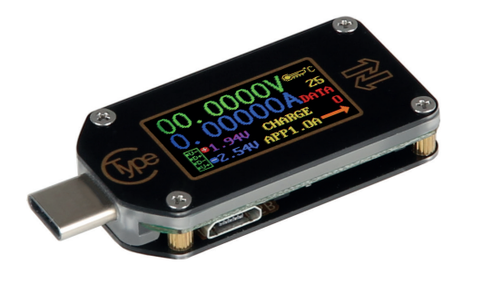
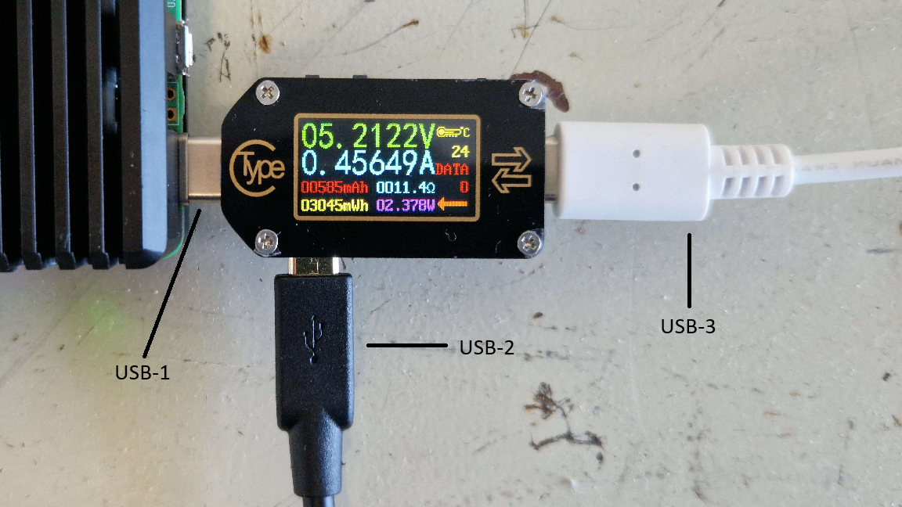
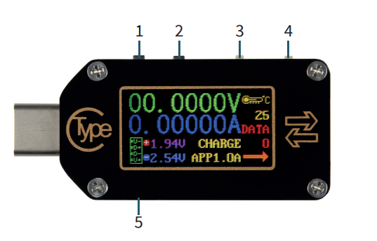

# TC66C Energy Meter Documentation and Usage Guide <!-- omit from toc -->

## Overview <!-- omit from toc -->
This document provides a comprehensive guide on using the TC66C USB-C energy meter with the PQC-LEO automated energy testing tooling. It covers the device specifications, potential use cases, and detailed instructions on how to set up and configure the TC66C device for automated energy usage testing. PQC-LEO currently supports TC66C data collection over the meter's micro-USB serial interface. Although the TC66C hardware also provides Bluetooth wireless communication, Bluetooth collection is not currently supported by PQC-LEO.

### Contents <!-- omit from toc -->
- [TC66C Device Overview and Specifications](#tc66c-device-overview-and-specifications)
  - [Device Overview](#device-overview)
  - [Device Specifications](#device-specifications)
- [Potential Devices that this meter can be used to test energy usage of:](#potential-devices-that-this-meter-can-be-used-to-test-energy-usage-of)
- [Configuring the Device for Automated Energy Testing](#configuring-the-device-for-automated-energy-testing)
  - [General Environment Layout](#general-environment-layout)
  - [TC66C Device Connection Layout](#tc66c-device-connection-layout)
  - [TC66C Power Switch Power Delivery (PD) Switch Configuration](#tc66c-power-switch-power-delivery-pd-switch-configuration)
- [Additional Documentation](#additional-documentation)

## TC66C Device Overview and Specifications

### Device Overview
The [TC66C](https://joy-it.net/en/products/JT-TC66C) is a small USB-C multimeter device that can be used to measure various electrical metrics such as voltage, current, power, and energy consumption. The manufacturer of the TC66C provides the following description of the device:

"The TC66C is a small but multifunctional USB C multimeter. Due to the support of current Quick Charge Standards it can also be used in conjunction with current handheld hardware. In addition, the unit offers convenient analysis via a BT wireless interface."

A copy of the user manual and product data sheet for the TC66C device can be found in the following links:

- [TC66C User Manual](https://joy-it.net/files/files/Produkte/JT-TC66C/JT-TC66C-Manual-20201023.pdf)
- [TC66C Product Data Sheet](https://joy-it.net/files/files/Produkte/JT-TC66C/JT-TC66C_Datasheet_2021-06-30.pdf)

### Device Specifications
The TC66C has the following specifications as provided by the manufacturer:

| **Specification**             | **Details**                                          |
|-------------------------------|------------------------------------------------------|
| Screen                        | 0.96 Inch IPS Display                                |
| Refresh rate                  | 2 Hz                                                 |
| Interfaces                    | USB type C 3.0, BT-Wireless interface                |
| Quick Charge Recognition      | QC2.0, QC3.0, Huawei FCP,Huawei SCP, Samsung AFC, PD |
| Voltage input                 | 3,5—24 V                                             |
| Voltage measurement range     | 0,005 - 30 V                                         |
| Voltage resolution            | 0,1 mV                                               |
| Voltage accuracy              | ± 0,5 ‰ (+10 digits)                                 |
| Current measurement range     | 0 - 5 A                                              |
| Current resolution            | 0,01 mA                                              |
| Current accuracy              | ± 1 ‰ (+20 digits)                                   |
| Power measurement range       | 0 - 150 W                                            |
| Capacity accumulation range   | 0 - 99,999 mAh                                       |
| Energy accumulation range     | 0- 999,99 Wh                                         |
| Load impedance range          | 1 – 9,999.9 Ω                                        |
| Temperature measurement range | 0 - 80 °C                                            |
| Work temperature range        | 0 – 45 °C                                            |
| Temperature measurement error | ± 3 °C                                               |

Firmware **version v1.18** was used in testing when integrating support for the TC66C device into PQC-LEO.

## Potential Devices that this meter can be used to test energy usage of:
As the TC66C device provides its power output via a USB-C interface, it can be used to test the energy usage of any device that can be powered via a USB-C interface and is within the power output specifications of the TC66C device.

## Configuring the Device for Automated Energy Testing
This section details how the device should be connected and configured for use in automated energy usage testing with PQC-LEO. These steps should be followed before enabling the energy metric collector script to ensure that the TC66C device is properly configured and connected to the collection machine and testing machine for automated energy usage testing.

Once the device has been properly connected and configured, the user can return to the setup instructions in the [PQC Energy Usage Testing Guide](../../../testing_tools_usage/pqc_energy_usage_testing.md) to continue with the setup of the automated energy usage testing environment.

### General Environment Layout
The General environment setup for using the TC66C device for automated energy testing is as follows:

### TC66C Device Connection Layout
To utilise the TC66C device for the automated energy testing, the device must be connected to the collection machine and the testing machine in the following manner:

Where:
- **USB-1 (USB-C)** - is connected to the testing device, and is used to provide power to the testing device using the power coming from the power source on USB-3, with the TC66C device measuring the energy consumption between USB-1 and USB-3.
  
- **USB-2 (micro-USB)** - is connected to the collection machine and is used for providing power to the TC66C device and for data communication between the TC66C device and the collection machine to facilitate the energy data collection process.

- **USB-3 (USB-C)** - is connected to the power source and is used to provide power to the testing device that is being tested through the TC66C device.

Whilst the TC66C device supports Bluetooth wireless communication, PQC-LEO does not currently support the use of the TC66C device via Bluetooth wireless communication. The TC66C device must be connected to the collection machine via USB-2 (micro-USB) for energy data collection to work with PQC-LEO.

### TC66C Power Switch Power Delivery (PD) Switch Configuration
The TC66C device supports configuring how it is powered and how it handles USB-C Power Delivery (PD). This functionality is controlled by two physical switches on the device and should be configured before starting an automated energy usage test.

*^Image taken from the [TC66C User Manual](https://joy-it.net/files/files/Produkte/JT-TC66C/JT-TC66C-Manual-20201023.pdf)*

- **PWR switch (switch-3)** - controls whether the TC66C takes its own operating power from the USB-C power path being measured. When this switch is set to **OFF**, the TC66C should be powered independently through the micro-USB port. This is the recommended configuration for automated testing, as it prevents the TC66C's own power usage from affecting the measurement of the testing device.

- **PD switch (switch-4)** - controls whether the TC66C's USB-C PD trigger function is active. When measuring a device that is being charged or powered through the TC66C, this switch should normally be set to **OFF** so that the power source and testing device can negotiate power delivery normally. The switch should only be set to **ON** when the TC66C is being used to trigger a specific PD power mode from a compatible power source.

For automated energy testing with PQC-LEO, the recommended switch configuration is:

| **Switch** | **Recommended setting** | **Reason**                                                                    |
|------------|-------------------------|-------------------------------------------------------------------------------|
| PWR        | OFF                     | Powers the TC66C independently from the micro-USB connection.                 |
| PD         | OFF                     | Allows the testing device and USB-C power source to negotiate power normally. |

## Additional Documentation
- [TC66C Webpage](https://joy-it.net/en/products/JT-TC66C)
- [TC66C User Manual](https://joy-it.net/files/files/Produkte/JT-TC66C/JT-TC66C-Manual-20201023.pdf)
- [TC66C Product Data Sheet](https://joy-it.net/files/files/Produkte/JT-TC66C/JT-TC66C_Datasheet_2021-06-30.pdf)
