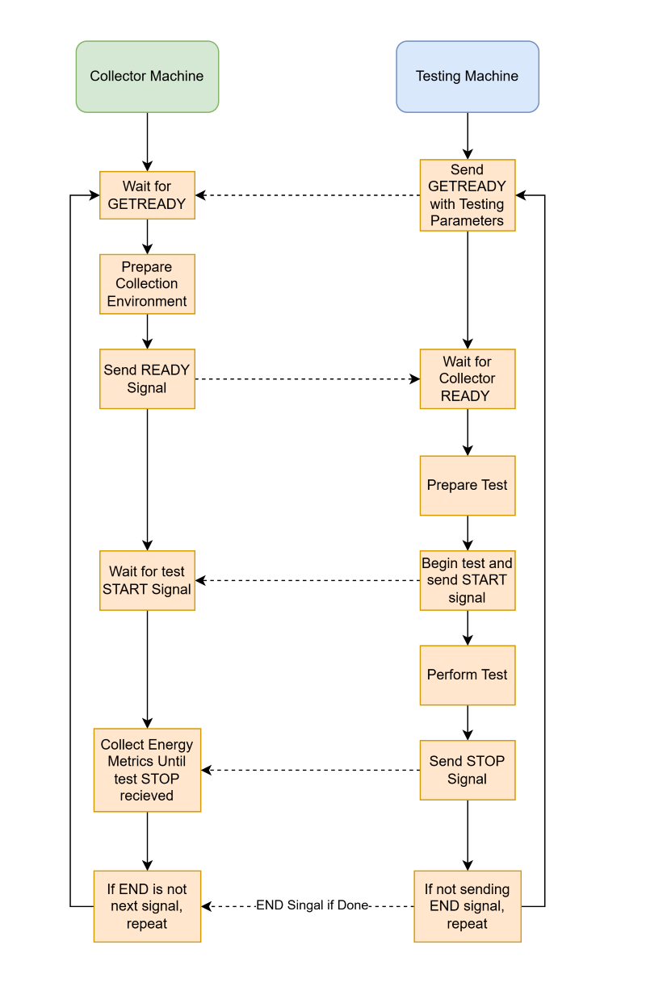
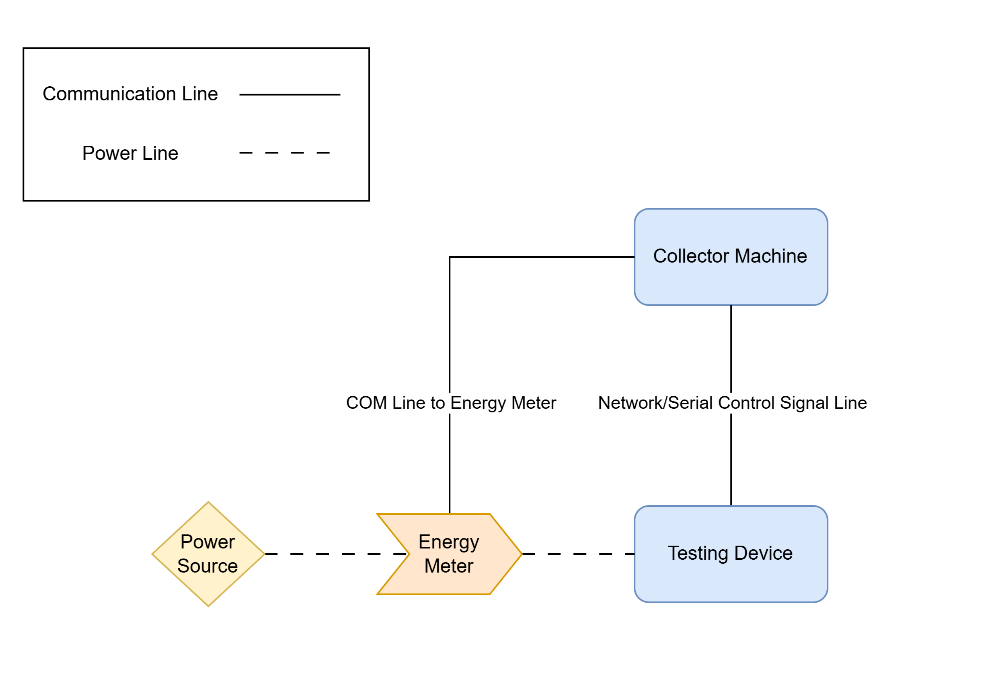

# Automated PQC Energy Usage Testing Guide <!-- omit from toc -->

## Overview <!-- omit from toc -->
This document provides a general guide for using the automated energy usage testing tools provided by PQC-LEO. It covers the supported testing types, required hardware and software setup, energy meter configuration, control signalling between devices, and the general process followed when collecting energy usage metrics during automated tests.

The automated energy usage testing tools support PQC computational energy usage testing, TLS handshake energy usage testing, and TLS speed energy usage testing. These tools provide the mechanisms for coordinating and collecting energy usage metrics data during testing, and are designed to be used in conjunction with the `energy_collector_tools` provided by PQC-LEO.

The relevant automated energy usage testing scripts can be found in the `scripts/test_scripts` directory from the project's root.

### Contents <!-- omit from toc -->
- [Available Automated Testing Tools](#available-automated-testing-tools)
- [Software and Hardware Requirements](#software-and-hardware-requirements)
  - [General Requirements](#general-requirements)
  - [Supported Hardware](#supported-hardware)
  - [Supported Energy Meters](#supported-energy-meters)
- [Supported Algorithms](#supported-algorithms)
- [Automated Testing Process](#automated-testing-process)
- [Enabling Support for Test Control Signalling](#enabling-support-for-test-control-signalling)
  - [Network-Based Communication Channel](#network-based-communication-channel)
  - [Serial Communication Channel](#serial-communication-channel)
- [Preparing the Testing Environment](#preparing-the-testing-environment)
  - [Standard Testing Environment Layout](#standard-testing-environment-layout)
  - [Setting up the Energy Meter for Data Collection](#setting-up-the-energy-meter-for-data-collection)
  - [Preparing the Collection Machine for Data Collection](#preparing-the-collection-machine-for-data-collection)
- [Performing the Automated Energy Usage Testing](#performing-the-automated-energy-usage-testing)
- [Advanced Testing Options](#advanced-testing-options)
  - [Custom System Performance State Configuration](#custom-system-performance-state-configuration)
  - [Custom Control Signalling Ports](#custom-control-signalling-ports)
- [Additional Documentation](#additional-documentation)

## Available Automated Testing Tools
The automated testing scripts provided by PQC-LEO currently support three types of energy usage testing:

- PQC computational energy usage testing
- TLS handshake energy usage testing
- TLS speed energy usage testing

#### PQC Computational Energy Usage Testing
This testing category evaluates the energy usage of the raw cryptographic operations performed by the supported PQC algorithms provided by the Liboqs library. It supports key generation, encapsulation, and decapsulation testing for KEM algorithms, as well as key generation, signing, and verification testing for digital signature algorithms.

#### TLS Handshake Energy Usage Testing
This testing category evaluates the energy usage of supported PQC, Hybrid-PQC, and classical algorithms within a TLS 1.3 handshake. It supports testing different combinations of KEM and digital signature algorithms available through OpenSSL and the OQS-Provider library.

#### TLS Speed Energy Usage Testing
This testing category evaluates the energy usage of PQC and Hybrid-PQC algorithms when performing TLS operations through the OpenSSL command-line tool. This includes the overhead introduced by using these algorithms through the OpenSSL library. It supports key generation, encapsulation, and decapsulation testing for KEM algorithms, as well as key generation, signing, and verification testing for digital signature algorithms.

## Software and Hardware Requirements

### General Requirements
To utilise the automated testing script for PQC energy usage evaluation, there are a few general requirements and details to be aware of:

- Installation mode `1` or `2` of the setup script must be selected, with yes being selected when prompted to install the energy usage testing tools and dependencies.

- A supported energy meter must be properly set up and configured for use with the testing scripts. For details on supported energy meters and testing environment setup instructions, please refer to the [Supported Energy Meters](../energy_meter_guides/energy_meter_support.md).

- A sufficient form of communication between the testing and collection machine must be available and operational for control signalling to effectively take place. For details on the required communication setup and configuration, please refer to the [Enabling Support for Test Control Signalling](#enabling-support-for-test-control-signalling) section.

### Supported Hardware
The automated testing tool is currently only supported on the following devices:

- x86 Linux Machines using a Debian-based operating system
- ARM Linux devices using a 64-bit Debian-based Operating System

To collect energy usage metrics during testing, a collection machine must be used in conjunction with the testing machine and energy meter. The collection machine must also be a supported device and must be able to communicate with the energy meter to collect the energy usage metrics data during testing.

### Supported Energy Meters
The automated energy testing scripts and collection tools provided by PQC-LEO are designed to support a variety of energy meters. However, current support is limited. The tools have been developed to allow users to add support for new energy meters with relative ease, while continued development aims to provide support for additional energy meters in the future.

For details on the currently supported energy meters and instructions for configuring them for use with the testing scripts, please refer to the following documentation:

[Supported Energy Meters](../energy_meter_guides/energy_meter_support.md)

For details on how to add support for new energy meters, please refer to the following documentation:

[Integrating New Energy Meters](../developer_information/energy_collector_APIs/integrating_new_energy_meters.md)

## Supported Algorithms
The PQC, Hybrid-PQC, and classical algorithms that are supported for standard performance testing in PQC-LEO are also supported for energy usage testing using the automated testing scripts. However, there is an **exception** to this in regards to the TLS speed energy usage testing where the following OpenSSL Hybrid-PQC are not supported:

- X25519MLKEM768
- X448MLKEM1024
- SecP256r1MLKEM768
- SecP384r1MLKEM1024

For further details on supported algorithms, please refer to the following documentation:

[Supported Algorithms](../supported_algorithms.md)

## Automated Testing Process
To understand the steps that should be taken to prepare the testing environment for energy usage testing, it is important to first understand the general process that is followed when using the automated testing scripts. The below image details the general steps taken during testing to signal and coordinate the testing and energy data collection process between the testing machine and the collection machine.



The control signalling and coordination process between the testing machine and the collection machine is facilitated through the use of a communication channel between the two machines. The communication channel is used to indicate when testing is starting and stopping, which in turn signals when energy data collection should start and stop on the collection machine.

## Enabling Support for Test Control Signalling
Currently the control signalling process can utilise either a network-based communication channel or a serial communication channel. The following sub-sections provide an overview of the general steps that should be taken to support the use of each type of communication channel for control signalling when using the automated testing scripts.

### Network-Based Communication Channel
To use network-based communication for control signalling, the testing machine and the collection machine must have a network connection that allows them to communicate with each other. Currently, the control signalling process uses UDP packets to send signals, with support for TCP packets to be added in the future.

By default, the following ports are used for network-based control signalling when using the automated testing scripts and should be open and available for use on both the testing machine and the collection machine:

| **Port Usage**    | **Default UDP Port** |
|-------------------|----------------------|
| Collector Machine | 26000                |
| Testing Machine   | 26001                |

It is possible to alter the default ports used. Pass `--use-custom-eng-control-ports` to the computational or TLS handshake testing script, or `--use-custom-net-control-ports` to the TLS speed testing script, and provide the custom ports when prompted.

During operation, the user will be prompted to enter the following information to configure the network-based communication channel when calling the automated testing scripts:

- The local IP address to be used for listening for incoming control signals
- The remote IP address to be used for sending control signals to

### Serial Communication Channel
A bidirectional serial connection must be established between the testing machine and the collection machine to allow for control signalling to take place. The serial connection must also be configured to use a baud rate of 115200, with support for other baud rates to be added in the future. There are several methods by which this connection can be established, including using a USB-to-UART adapter or a direct UART connection between the two devices. The specific method used will depend on the hardware requirements of the devices being used. The tools available within PQC-LEO for serial communication are **limited to Linux operating systems** only.

**Please refer to documentation specific to your device on enabling UART support and establishing a serial connection** between the testing machine and the collection machine for details on how to set up a serial connection for control signalling. During operation, the user will be prompted to select which serial port to use during testing.

## Preparing the Testing Environment
Before using the automated testing scripts for energy usage evaluations, the testing environment must be properly prepared and configured. The following section provides an overview of the general steps that should be taken to prepare the testing environment for energy usage testing.

It is important to note that if using the `energy_collector_tools` outside of the provided automation scripts, the way in which the testing environment is prepared and configured may differ. Please refer to the relevant energy meter and collection tools documentation for details on how to prepare and configure the testing environment when using the energy collector tools outside of the provided automation scripts. Links to the relevant documentation can be found in the [Additional Documentation](#additional-documentation) section of this guide.

This section provides the general steps to configure the environment for testing, so please review the following sub-sections carefully to understand the necessary steps to prepare the testing environment for energy usage testing using the automated testing scripts. This section provides guidance on the following steps:

- Details on the standard testing environment device setup
- Guidance on setting up the energy meter for data collection
- Guidance on preparing the collection machine for data collection

### Standard Testing Environment Layout
When using the automated testing scripts and collection tools provided by PQC-LEO, the testing environment will follow this general structure:



How the energy meter is accessed and utilised will differ depending on the specific energy meter being used and the way in which it is set up. For details on how to set up and configure supported energy meters for use with the automated testing scripts, please refer to the [Supported Energy Meters](../energy_meter_guides/energy_meter_support.md) guide.

### Setting up the Energy Meter for Data Collection
When using the automated testing scripts, the energy meter must be configured so that the collection machine can access the energy usage metrics collected during testing. The setup process depends on the specific energy meter being used and how it is connected.

For instructions on configuring supported energy meters for use with the automated testing scripts, refer to the [Supported Energy Meters](../energy_meter_guides/energy_meter_support.md) guide.

### Preparing the Collection Machine for Data Collection
After the energy meter is properly connected to the collection machine, the following script located in the `scripts/test_scripts` directory can be used to start the energy usage data collection process on the collection machine:

```
./energy_metric_collector.sh
```

This script provides an automated interface for the `collector` program included within the PQC-LEO `energy_collector_tools`. It is possible to use the `collector` program directly without using the `energy_metric_collector.sh` script, but the script provides a more user-friendly interface for easily starting and configuring the collection process. For details on how to use the `collector` program directly, please refer to the [energy collector tools usage guide](../project_tools_guides/energy_collector_usage_guide.md).

Once the script has been called, the user will then be prompted to enter in the following parameters to configure the collection process:

- Which test collection type is being performed (out of the supported energy usage testing types)
- Whether the results should have a custom Machine-ID assigned to them
- The number of test runs that will be performed

After these parameters have been entered, the script will prompt the user to configure the communication channel that will be used for control signalling between the testing machine and the collection machine. For details on how to set up the communication channel, please refer to [Enabling Support for Test Control Signalling](#enabling-support-for-test-control-signalling).

Finally, after the communication channel has been configured, the script will prompt the user to select the which supported energy meter type will be used for data collection. After the meter type has been selected, the remaining device-specific communication setup prompts are shown (for example selecting the serial port used by the meter). This process may differ between devices, so please refer to the relevant energy meter documentation for details on configuration steps.

## Performing the Automated Energy Usage Testing
After the testing environment has been properly prepared and configured, the automated energy usage testing can be initiated. The process will differ depending on the specific type of energy usage testing being performed.

Please refer to the following guides for details on how to perform each of the supported testing types:

- [PQC Computational Energy Usage Testing Guide](./energy_usage_testing_guides/comp_energy_usage_testing.md)
- [TLS Handshake Energy Usage Testing Guide](./energy_usage_testing_guides/tls_handshake_energy_usage_testing.md)
- [TLS Speed Energy Usage Testing Guide](./energy_usage_testing_guides/tls_speed_energy_usage_testing.md)

Once testing has been completed, the collected energy usage metrics will be available on the collection machine. Please refer to the **Outputted Results** section of the relevant testing guide for details on where the collected energy usage metrics data is stored and how to access it.

## Advanced Testing Options
The following advanced testing options can be enabled by passing the relevant command line arguments to the automated testing scripts:

- Custom System Performance State Configuration
- Custom Control Signalling Ports

### Custom System Performance State Configuration
By default, the testing scripts will automatically configure the system performance state for energy usage testing, which includes setting the CPU performance to maximum and selecting a specific target CPU core for testing processes. However, it is possible to manually configure the system performance state settings by passing the `--use-custom-sys-state` flag to the testing script and configuring the desired settings when prompted. This allows for more granular control over the system performance state settings during energy usage testing, which can be useful for testing under different system performance conditions.

An example of using this flag when launching the testing script is as follows:

```
./pqc_performance_energy_test.sh --use-custom-sys-state
```

### Custom Control Signalling Ports
By default, the automated testing scripts for energy usage evaluations use set UDP ports for network-based control signalling between the testing machine and the collection machine.

However, it is possible to alter the default ports used for control signalling. Pass `--use-custom-eng-control-ports` to the computational or TLS handshake testing script, or `--use-custom-net-control-ports` to the TLS speed testing script, and provide the custom ports when prompted.

An example of using this flag when launching the testing script is as follows:

```
./pqc_performance_energy_test.sh --use-custom-eng-control-ports
```

## Additional Documentation
- [Supported Energy Meters](../energy_meter_guides/energy_meter_support.md)
- [Integrating New Energy Meters](../developer_information/energy_collector_APIs/integrating_new_energy_meters.md)
- [Supported Algorithms](../supported_algorithms.md)
- [Project Tools](../developer_information/project_tools.md)
- [Comp Energy Usage Tester Tool Guide](../project_tools_guides/comp_energy_tester_usage_guide.md)
- [Energy Collector Tool Guide](../project_tools_guides/energy_collector_usage_guide.md)
